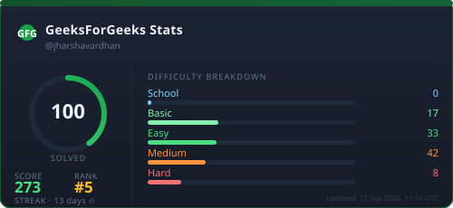

<div align="center">


[](https://www.linkedin.com/in/jagannati-harsha-vardhan-38117637b/)
[](https://huggingface.co/HarshavardhanJ)
[](https://leetcode.com/u/JAGANNATI_HARSHAVARDHAN/)
[](https://www.geeksforgeeks.org/profile/jharshavardhan/)
[](https://github.com/J-harshavardhan)


&nbsp;


</div>

---

## 🧑‍💻 About Me

```python
class HarshaVardhan:
    name       = "Jagannati Harsha Vardhan"
    role       = "AI/ML Student → Future ML Engineer"
    education  = "Certificate in AI & ML — IIT Patna × Masai School"
    languages  = ["Python", "Java", "SQL"]
    interests  = ["Machine Learning", "Deep Learning", "NLP", "Data Science"]
    currently  = "Building intelligent systems & sharpening DSA skills"
    open_to    = ["Data Analyst Internships", "ML Projects", "Collaborations"]
    motto      = "Always learning. Always building. 🚀"
```

---

## 🛠️ Tech Stack & Tools

**Languages**


**AI / ML / Data**


**Tools & Platforms**


**CS Fundamentals**


---

## 🚀 Featured Projects

### 🛡️ [ChurnGuard — Customer Churn Prediction](https://github.com/J-harshavardhan/mini_project-2)
> **Mini Project 2** — AI & ML Program (IIT Patna × Masai School)

A complete **end-to-end ML pipeline** to predict telecom customer churn with 90% recall, built with production-quality data cleaning, model comparison, cross-validation, and a 3-panel analytics dashboard.

```
Raw CSV (1030 rows) → Clean → Train/Compare → Predict → Visualize Dashboard
```

- 🧹 **Data cleaning** — fixed 8 real-world issues: mixed casing, typos, outliers, 30 duplicates, 205 missing cells
- 🤖 **Model comparison** — Logistic Regression vs Random Forest with 5-Fold Stratified CV
- 🏆 **ROC-AUC: 0.814** | Churn Recall: **90%** | Winner: Logistic Regression
- 📊 **3-panel dashboard** — dataset overview, behaviour deep-dive, confusion matrix + ROC curve
- 🔮 **Interactive predictor** — takes customer input and outputs churn probability % + risk level

**Key Insights:** Month-to-month contracts & electronic check payments have highest churn; senior citizens and high monthly charges are major risk signals.


<details>
<summary>📊 View Dashboard</summary>

**Figure 1 — Dataset Overview**


**Figure 2 — Customer Behaviour Deep-Dive**


**Figure 3 — Model Evaluation**


</details>

---

### 🧹 [Data Cleaning Environment Server](https://huggingface.co/spaces/HarshavardhanJ/data-cleaning-env)
> **OpenEnv Hackathon × Scaler** — Solo Beginner Track

An end-to-end **Reinforcement Learning environment** for automated data cleaning tasks, built as an OpenAI Gym-compatible environment and deployed on HuggingFace Spaces.

- 🏗️ Custom action space for data cleaning operations (handle nulls, remove duplicates, fix dtypes, etc.)
- ⚙️ Full REST API compliance with async methods for step, reset & render
- 🚢 Deployed on HuggingFace Spaces with Docker containerization
- ✅ Passed automated environment validation checks


---

### 📊 [TrendPulse — What's Actually Trending Right Now](https://github.com/J-harshavardhan/trendpulse-Harshavardhan_J)
> **Mini Project 1** — AI & ML Program (IIT Patna × Masai School)

A complete **end-to-end data pipeline** that collects, cleans, analyzes, and visualizes real-time trending data from Reddit using a modular ETL architecture.

```
Reddit API → Data Collection → Data Cleaning → Analysis → Visualization Dashboard
```

- 🔌 **Reddit API integration** — fetches live trending posts from multiple subreddits
- 🧹 **Data cleaning** — removes duplicates, nulls, filters low-quality posts
- 📐 **Statistical analysis** — mean, median, std dev, engagement scoring via Pandas & NumPy
- 📊 **4-panel dashboard** — bar charts, scatter plots & combined overview using Matplotlib
- 🏗️ **Modular architecture** — 4 independent pipeline scripts (collect → process → analyse → visualize)


---

## 📊 GitHub Stats

<div align="center">

<!-- ✅ LIVE — auto-updates on every push -->

&nbsp;


<br/><br/>

<!-- ✅ LIVE — streak auto-updates daily -->


</div>

---

## 🧩 DSA & Problem Solving

<div align="center">

[](https://leetcode.com/u/JAGANNATI_HARSHAVARDHAN/)
&nbsp;&nbsp;
[](https://www.geeksforgeeks.org/profile/jharshavardhan/)

### 🟡 LeetCode Stats
<!-- ✅ LIVE — updates instantly on every solve -->


<br/>

### 🟢 GeeksForGeeks Stats
<!-- ✅ LIVE — auto-updated every 3 hours by GitHub Actions -->
<a href="https://www.geeksforgeeks.org/profile/jharshavardhan/">
  
</a>

<br/>

### 📊 Coding Activity Summary

<!-- ✅ LeetCode badges — LIVE via alfa-leetcode-api.onrender.com -->
<!-- ✅ GFG badges — LIVE via gfg-stats.tashif.codes (FastAPI, uses GFG's own JSON endpoints) -->
<!-- ✅ GFG stats card — LIVE via gfgstatscard.vercel.app -->
<!-- ✅ Streak — LIVE via demolab streak-stats JSON endpoint -->

| Platform | 💻 Solved | 📊 Breakdown | 🏆 Achievement |
|:---:|:---:|:---:|:---:|
| 🟡 **LeetCode** | [](https://leetcode.com/u/JAGANNATI_HARSHAVARDHAN/) | [](https://leetcode.com/u/JAGANNATI_HARSHAVARDHAN/) [](https://leetcode.com/u/JAGANNATI_HARSHAVARDHAN/) [](https://leetcode.com/u/JAGANNATI_HARSHAVARDHAN/) | [](https://leetcode.com/u/JAGANNATI_HARSHAVARDHAN/) |
| 🟢 **GeeksforGeeks** | [](https://www.geeksforgeeks.org/profile/jharshavardhan/) | [](https://www.geeksforgeeks.org/profile/jharshavardhan/) [](https://www.geeksforgeeks.org/profile/jharshavardhan/) | [](https://www.geeksforgeeks.org/profile/jharshavardhan/) |
| 🔥 **Combined** |  | LeetCode + GFG | [](https://github.com/J-harshavardhan) |

</div>

---

## 📈 Contribution Graph

<div align="center">

</div>

---

## 🏆 Milestones & Achievements

<div align="center">

<!-- ✅ GitHub streak milestones — LIVE via demolab JSON endpoint -->

&nbsp;

&nbsp;


<br/><br/>

<!-- ✅ LeetCode milestones — LIVE via alfa-leetcode-api -->

&nbsp;

&nbsp;

&nbsp;


<br/><br/>

<!-- ✅ GFG milestones — LIVE via gfgstatsapi -->

&nbsp;

&nbsp;


<br/><br/>

<!-- ✅ ChurnGuard project badge -->

&nbsp;

&nbsp;


</div>

---

## 🎯 Current Focus

```
🤖  Mastering Machine Learning & Deep Learning
🧩  Strengthening DSA with Java
📊  Building real-world AI/ML projects
🔍  Exploring NLP and Computer Vision
💼  Open to Data Analyst & ML Internships
```

---

## 📚 Education

🎓 **Certificate Program in AI & Machine Learning**
&nbsp;&nbsp;&nbsp;&nbsp;IIT Patna × Masai School (Vishlesan i-Hub) · Jan 2026–Present

🏫 **B.Tech — Geethanjali Institute of Science and Technology (GIST)**
&nbsp;&nbsp;&nbsp;&nbsp;Nellore, Andhra Pradesh

---

<div align="center">


**⭐ If you like what I'm building, consider starring my repos!**

</div>
